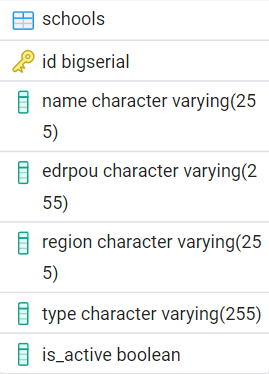

# School Management System



На зображенні вище представлено ERD бази даних. Одна таблиця.

##  Запуск проєкту

Для запуску застосунку використовуйте Docker Compose:

1. Спочатку зберіть backend проєкт у `.jar` файл:

```bash
./mvnw clean package
```

2. Потім запустіть Docker Compose:

```bash
docker-compose up --build
```

##  Доступ до фронтенду

Після запуску застосунок буде доступний за адресою:

[http://localhost:3000](http://localhost:3000)

##  Технології

* **Backend:** Java + Spring Boot
* **Frontend:** React + TypeScript
* **Database:** PostgreSQL
* **Контейнеризація:** Docker + Docker Compose
